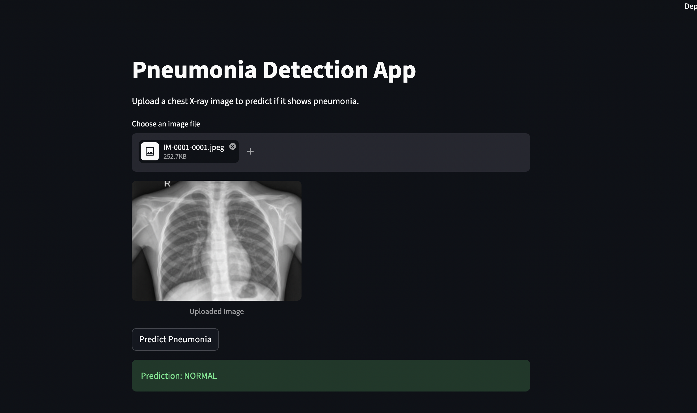
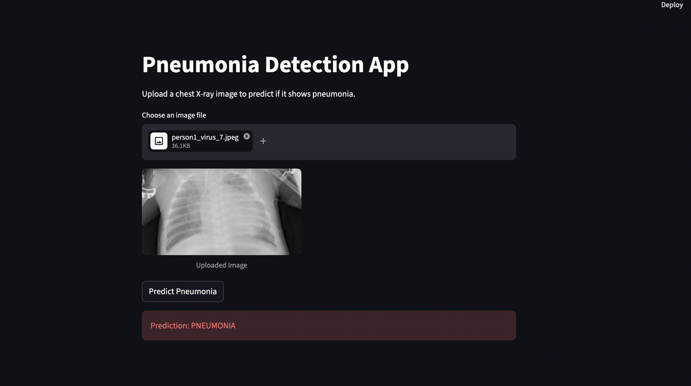

# Pneumonia Prediction App

An AI-powered application designed to detect pneumonia from chest X-ray images using deep learning. This project implements a complete pipeline from PyTorch model training to **ONNX Runtime inference** in a deployable web application.

## 🚀 Features
- **Deep Learning Model**: Uses a fine-tuned ResNet18 architecture for high-accuracy binary classification (Normal vs. Pneumonia).
- **ONNX Inference**: Production API serves predictions via **ONNX Runtime** for faster, portable inference.
- **FastAPI Backend**: A robust REST API that handles image uploads and returns predictions with confidence scores.
- **Streamlit Frontend**: A user-friendly web interface for uploading X-ray images and viewing real-time predictions.
- **Pre-processing Pipeline**: Integrated image normalization and resizing to ensure consistent model input.

## 📸 Screenshots





## 🛠️ Tech Stack
- **Language**: Python
- **Deep Learning Framework**: PyTorch, Torchvision (training & export)
- **Inference Runtime**: ONNX Runtime
- **Model Format**: ONNX (`.onnx` + external weights `.onnx.data`)
- **Backend Framework**: FastAPI
- **Frontend Framework**: Streamlit
- **Image Processing**: PIL (Pillow)
- **Metrics**: Scikit-learn (Accuracy Score)

## 📂 Project Structure
```text
.
├── Model Notebooks/       # Training scripts and dataset
│   ├── data/              # Chest X-ray dataset (train, test, val)
│   └── train_model.py     # Model training and evaluation script
├── modelWeights/          # Saved model artifacts
│   ├── pneumonia_model.pth        # PyTorch weights (training / re-export)
│   ├── pneumonia_model.onnx       # ONNX model graph
│   └── pneumonia_model.onnx.data  # ONNX external weights
├── src/                   # Source code
│   ├── api/               # FastAPI implementation
│   │   └── app.py         # API endpoints (ONNX Runtime inference)
│   ├── core/              # Core utility functions
│   │   └── utils.py       # Image preprocessing logic
│   ├── inference_onnx.py  # One-time PyTorch → ONNX export script
│   └── pneumonia_model.py # Model architecture and PyTorch loading
├── streamlit_app.py       # Streamlit frontend application
├── requirements.txt       # Project dependencies
└── pyproject.toml         # Project configuration
```

## ⚙️ Installation & Setup

### 1. Clone the Repository
```bash
git clone <repository-url>
cd "Pneominia Prediction"
```

### 2. Install Dependencies
```bash
pip install -r requirements.txt
```

### 3. Export the Model to ONNX (first time or after retraining)
If `modelWeights/pneumonia_model.onnx` is not present, export from the trained PyTorch weights:
```bash
python -m src.inference_onnx
```
This creates `pneumonia_model.onnx` and `pneumonia_model.onnx.data` in `modelWeights/`. Keep both files together.

### 4. Run the Backend API
Start the FastAPI server:
```bash
uvicorn src.api.app:app --reload
```
The API will be available at `http://127.0.0.1:8000`. The `/predict` endpoint uses **ONNX Runtime** and returns:
```json
{
  "prediction": "PNEUMONIA",
  "confidence": 0.9642,
  "prediction_index": 1
}
```

### 5. Run the Frontend App
In a separate terminal, start the Streamlit app:
```bash
streamlit run streamlit_app.py
```
The app will open in your browser.

## 🧠 Model Implementation
The model utilizes **Transfer Learning** with a pre-trained **ResNet18** model.
- **Input**: $224 \times 224$ RGB images.
- **Modification**: The final fully connected layer is replaced with a linear layer outputting 2 classes.
- **Training**: The model was trained using CrossEntropyLoss and the Adam optimizer (PyTorch).
- **Inference**: The trained model is exported to ONNX and served with **ONNX Runtime** in the FastAPI backend. Softmax and confidence scoring run in NumPy after the ONNX forward pass.

### Inference pipeline
```text
Upload X-ray → preprocess (224×224, ImageNet normalize) → ONNX Runtime → softmax → prediction + confidence
```

## 📝 License
[Specify your license here, e.g., MIT]
